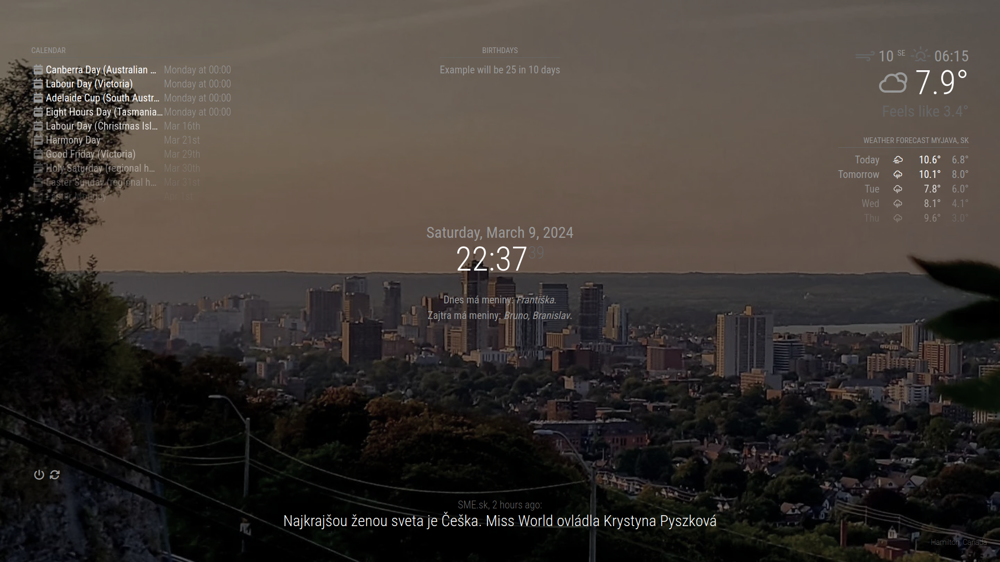

# MagicMirrorConf
My MagicMirror config with touch support for my touch device.

## WARNING
This config.js is using MagicMirror 3rd party modules. To download them, check out this github wiki page (https://github.com/MagicMirrorOrg/MagicMirror/wiki/3rd-party-modules)

## Screenshot

